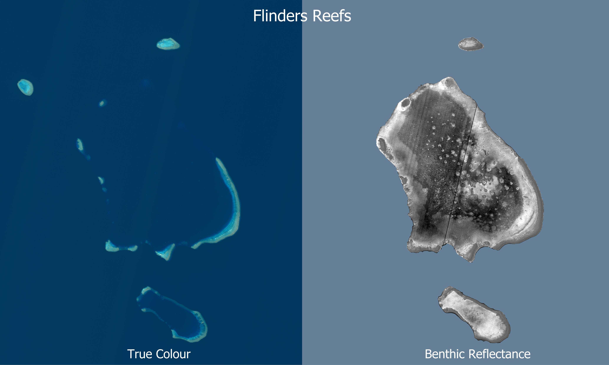

# Estimation of benthic reflectance from satellite imagery and bathmetry - Analysis code

This code repository contains scripts for estimating benthic reflectance derived from Sentinel 2 imagery and bathymetry. This algorithm was developed for estimating benthic reflectance to assist in the mapping of marine vegetation (algae) and deep reefs on coral atolls in the Coral Sea. 

More details are provided on the projects in the [metadata record](https://doi.org/10.26274/s2a8-nw72) for this repository.



A high level overview of the analysis is:
1. Cut up the imagery and bathymetry into the analysis areas, aligning the bathymetry to the the same resolution and pixel alignment as the satellite imagery.
2. Extract the matching depth and satellite image brightness levels for the sampling points.
3. Fit curves for the brightness vs depth for each area and benthic reflectance classifications. Use a model that assumes exponential decay in brightness with depth combined with an offset in brightness due to scattered light.
4. Scale the each satellite channel brightness between the the predicted brightness for high and low benthic reflectance based on the bathymetry.

This analysis includes test cases for: 
- **55KFA-8**: North Flinders reef composite of 8 images and GBR 2020 30 m bathymetry - Reference case with clearest imagery and good bathymetry.
- **55KFA-1**: North Flinders reef with single best image - To show much much difference using an image composite makes to the result.
- **55KFA-8-gbr100**: North Flinders reef with lower resolution 100 m bathymetry - To show the effect of lower resolution bathymetry.
- **55KFA-8-NoSGC**: North Flinders reef with an 8 image composite, but without sunglint correction - To show the benefit of sunglint correction.
- **55KEB**: Holmes Reefs GBR 2020 30 m bathymetry - For comparison with JCU drop camera benthic surveys.
- **56KLF-7-gbr100**: Lihou Reefs - To see the effectiveness when the bathymetry is limited.
- **55KEV**: GBR north east of Townsville including Davies Reefs, Grub Reef, Chicken Reef, and Bowl Reef - To assess the performance in waters with lower water clarity and high suspended sediment than the Coral Sea.

To set up your Python environment to run the script that requires the imports listed, you will need to ensure that your system has Python installed and then set up a virtual environment. Here are the instructions you can include in your README.md:

## Input data

This algorithm requires the following inputs:
- High quality (low noise) high resolution (30 m) digital elevation model of bathymetry of the study area.
- Low noise clear sky, clear water image composite of the area - benthic features must be visible.
- Point data of locations classified as high or low benthic reflectance at each depth level. These are prepared manually based on review of the imagery.
- Analysis areas to perform the depth vs brightness modelling. Each area is modelled independently. Dividing the satellite imagery into multiple areas can be used to compensate for small brightness difference in radiance measurements of the staggered detectors in the Sentinel 2 imagery.

This analysis uses the imagery from Lawrey, E., Hammerton, M. (2024). Marine satellite imagery test collections (AIMS) [Data set]. eAtlas. https://doi.org/10.26274/zq26-a956 to test the effectiveness of the approach.

## Output data
The output data generated by this analysis is available from https://nextcloud.eatlas.org.au/apps/sharealias/a/CS_NESP-MaC-2-3_AIMS_Benth-Reflect

## Setup Instructions

### Prerequisites

- Python (3.7 or newer is recommended)
- pip (Python package manager)

### Setting up the environment

1. **Clone the repository:**

   First, clone this repository to your local machine using Git.

   ```
   git clone https://github.com/eatlas/CS_NESP-MaC-2-3_AIMS_Benth-Reflect.git
   cd CS_NESP-MaC-2-3_AIMS_Benth-Reflect
   ```

2. **Create a virtual environment:**

   It's recommended to use a virtual environment for Python projects. This keeps dependencies required by different projects separate by creating isolated environments for them.

   To create a virtual environment, run:

   ```
   python -m venv venv
   ```

   To activate the virtual environment, use the following command:

   - On Windows:
     ```
     .\venv\Scripts\activate
     ```
   - On Unix or MacOS:
     ```
     source venv/bin/activate
     ```

3. **Install the required packages:**

   Your script uses several packages that need to be installed. You can do this easily using `pip`. Run the following command to install all required packages:

   ```
   pip install geopandas rasterio pandas numpy shapely scipy matplotlib scikit-learn plotly
   ```

   This command installs all the necessary libraries, including those for handling geospatial data (Geopandas, Rasterio, Shapely), data analysis (Pandas, Numpy, Scipy), machine learning (Scikit-learn), and visualization (Matplotlib, Plotly).

4. **Verify the setup:**

   After installation, you can verify that everything is set up correctly by running a simple script that imports the libraries.

   ```
   python 00-verify-setup.py
   ```

   If all libraries are installed correctly, you will see a message saying "All imports are working correctly!"

## Running the scripts

### 00-verify-setup.py
Run this script to verify that all the required libraries are installed in Python.

### 01-download-src-data.py
Run this to download all the source data (satellite imagery and bathymetry) need for the analysis. This script is partly restartable. If the dataset has been downloaded and extracted then when re-run it won't try and redownload that dataset.

`data_download.py` is a utility library to help with the downloads.

### 02-process-data.py
Run this to perform the data analysis. This will generate intermediate data (such as clipped and aligned bathymetry and satellite imagery) and predicted brightness rasters, in the `working\depth-reflect` directory, with one subdirectory per case study. The final analysis plots, estimated benthic reflectance, and model parameters are saved in `output`. The `output` and `working` directories are excluded from this git repository to save on size. The results of the `output` folder is
available for download from the metadata record.

### 03_Depth-reflectance.qgz
This is a QGIS map file that is used to preview the final imagery and for creating the publication maps. It assumes that the source data has been downloaded and the data has been processed.